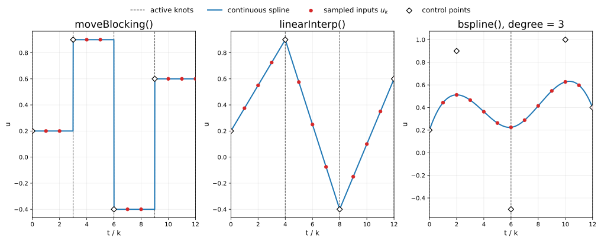
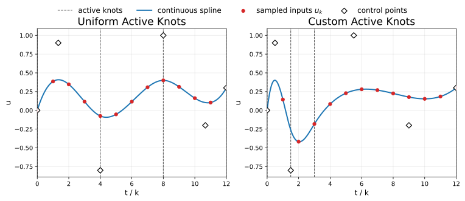

# Input Parameterization

## Motivation

We parameterize the input trajectory with a B-spline, which reduces the number of design variables in the MPC optimization.
For a fixed number of control points, the number of design variables contributed by the input trajectory is independent of the horizon length.

This can significantly reduce solve time for long horizons.
There is still computational cost in lengthening the horizon,
since the model must still be propagated across all horizon steps,
but the optimization search space can be much smaller than it would be without parameterization.

For example, a non-parameterized horizon with $T = 100$ steps and input dimension $m = 4$ yields at least $mT = 400$ input design variables.
If the same horizon is parameterized with only $\eta = 5$ control points,
that number drops to $m\eta = 20$.

Parameterization constrains how the input can vary over time, so the optimizer is solving over a smaller and more structured family of trajectories.
That is not necessarily a drawback.
B-splines are built from continuous polynomial segments, so they can produce smoother input trajectories and may reduce or eliminate the need for explicit slew-rate constraints in some applications.

This page gives the mathematical definition of the parameterization,
its sampled matrix form,
and the API-level factory methods provided by `Parameterization`.

--8<-- "concepts/nomenclature.md"

## B-Splines

B-splines are continuous in nature, but the MPC input trajectory $\{\mathbf{u}_k\}_{k=0}^{T-1}$ is discrete.
We therefore define a spline over the interval $t \in [0, T-1]$ and evaluate it at the integer horizon indices.
The parameterized input trajectory is given by

$$
\mathbf{u}_k = \sum_{i=0}^{\eta-1}  \mathbf{c}_i \, b_i^p(k, \boldsymbol{\tau}),
$$

where $\boldsymbol{\tau}$ is a non-decreasing knot vector.
The spline is valid on the active interval $[\tau_p, \tau_{\mu-p-1}]$.
These two knots are called the boundary knots,
while the knots between them (excluding the boundary knots) are called interior knots.
We refer to the set of boundary and interior knots as the active knots since the valid evaluation interval includes the boundaries.
For MPC, we match the boundary knots with the boundary horizon indices so that the spline is defined at each horizon index $k$:

$$
\tau_p = 0,
\qquad
\tau_{\mu-p-1} = T-1.
$$

The basis functions are defined by the Cox-de Boor recursion formula.

For $p=0$

$$
b_i^0(k, \boldsymbol{\tau}) =
\begin{cases}
1 & \tau_i \le k < \tau_{i+1}, \\
0 & \text{otherwise},
\end{cases}
$$

and for $p>0$

$$
b_i^p(k, \boldsymbol{\tau}) =
\frac{k - \tau_i}{\tau_{i+p} - \tau_i} b_i^{p-1}(k, \boldsymbol{\tau})
+ \frac{\tau_{i+p+1} - k}{\tau_{i+p+1} - \tau_{i+1}} b_{i+1}^{p-1}(k, \boldsymbol{\tau}),
$$

with the convention that terms with zero denominators are treated as zero.

### Matrix Representation

The B-spline basis functions can be represented as a matrix $\Psi$ to conveniently convert from a stacked vector of
control points to a stacked input trajectory:

$$
\mathbf{u} = \Psi^p(\boldsymbol{\tau}) \, \mathbf{c}.
$$

What is especially convenient about the matrix representation is that the matrix is constant for a given degree and knot vector.
This library fixes the degree and knot vector upon construction of an MPC object, so the weights in $\Psi$ are computed once at construction and stored for faster evaluation.
This matrix form is the bridge from spline parameterization to the QP derivation.
The next concepts page uses it to write the predicted state trajectory and cost in quadratic form.

## Provided Factory Methods


Comparison of the built-in parameterization factory methods for the same horizon and similar control-point values.
`moveBlocking()` produces piecewise-constant inputs,
`linearInterp()` produces piecewise-linear inputs,
and higher-degree `bspline()` produces smoother trajectories.
In all three cases, the optimizer chooses control points,
and the dense MPC input trajectory is obtained by evaluating the parameterization at the integer horizon indices.

### Move-Blocking

Move-blocking holds the input constant over the intervals between the change points.
It is the degree-zero special case of the B-spline framework.
The `Parameterization` class provides `moveBlocking()` for this purpose.

The two overloads are:

=== "Python"

    ```python
    param = Parameterization.moveBlocking(horizon_steps, num_control_points)
    param = Parameterization.moveBlocking(horizon_steps, change_points)
    ```

=== "C++"

    ```cpp
    auto param = Parameterization::moveBlocking(horizon_steps, num_control_points)
    auto param = Parameterization::moveBlocking(horizon_steps, change_points)
    ```

The first creates a uniform parameterization with equally sized blocks.
The second uses explicitly specified change points and therefore allows variable block widths.
The first change point must be $0$ and the minimum number of change points is 1, where the input trajectory would be constant.
When using the move-blocking factory method, the right boundary knot is internally appended to the list of change points to create the full knot vector.

### Linear Interpolation

Linear interpolation is the degree-one special case.
The input becomes piecewise linear over the horizon.
The `Parameterization` class provides `linearInterp()` for this purpose.

The two overloads are:

=== "Python"

    ```python
    param = Parameterization.linearInterp(horizon_steps, num_control_points)
    param = Parameterization.linearInterp(horizon_steps, endpoints)
    ```

=== "C++"

    ```cpp
    auto param = Parameterization::linearInterp(horizon_steps, num_control_points)
    auto param = Parameterization::linearInterp(horizon_steps, endpoints)
    ```

The first creates equally spaced segment endpoints.
The second accepts custom endpoints, which allows variable segment lengths.
The first endpoint must be $0$ and the last $T-1$ to properly set the boundary knots.
The minimum number of endpoints is 2, being the boundaries of a single line segment.

### Clamped B-Spline

The general `bspline()` factory method creates clamped B-splines of the specified degree.
In the full knot vector, the first and last knots have multiplicity $p+1$, so the trajectory starts at the first control point and ends at the last.

The two overloads are:

=== "Python"

    ```python
    param = Parameterization.bspline(horizon_steps, degree, num_control_points)
    param = Parameterization.bspline(horizon_steps, degree, active_knots)
    ```

=== "C++"

    ```cpp
    auto param = Parameterization::bspline(horizon_steps, degree, num_control_points)
    auto param = Parameterization::bspline(horizon_steps, degree, active_knots)
    ```

The first creates a uniform clamped spline.
The second accepts custom active knots, which allows nonuniform knot spacing.
The active knot vector must include at least the two boundary entries $0$ and $T-1$ so that the spline is valid over the MPC horizon.

## Tradeoffs and Interpretation

### Number of Control Points $\eta$

- Smaller $\eta$ reduces the optimization dimension and can significantly improve solve time.
- Larger $\eta$ gives the optimizer more freedom to shape the input trajectory.

### Degree $p$

- Lower degree gives a more local and less smooth trajectory representation.
- Higher degree gives smoother trajectories and broader basis support, but can somewhat flatten the input trajectory if
  the control points are saturated by the input limits since splines generally do not pass through control points.
  This can be remedied by saturating the evaluated input trajectory instead (when $p>1$).

### Knot Placement


Effect of active-knot placement on the same clamped spline degree and control-point values.
Changing the active-knot locations redistributes where the trajectory can vary more rapidly.

- Uniform knots distribute flexibility evenly across the horizon.
- Custom knots or change points concentrate flexibility where it is most needed.

Parameterization is therefore both a dimensionality-reduction tool and a way to shape the family of trajectories the optimizer may select.

## Next Step

The next step is to see how input parameterization affects the [QP Formulation](qp-formulation.md).
